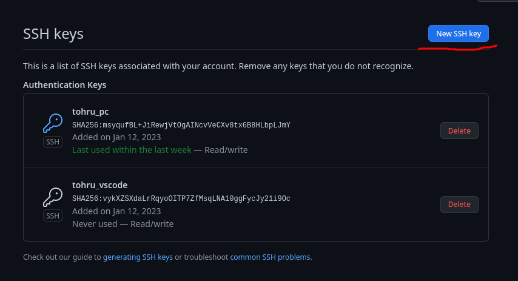

# Zapateria Angelina
Main branch

**Isidro brach** 'Ejemplo de nombre'
# Indice
- [Instalar git](#instalar-git)
- [Configuracion](#configuracion-inicial)
- [Github y SSH](#crear-un-usuario-en-github-y-agregar-clave-ssh)
- [Clonar un repositorio](#clonar-un-repositorio-de-github)
- [Obtener permisos](#obtener-permisos-de-lectura/escritura)
- [Branch's](#branch-o-ramas)
- [Subir cambios](#subir-los-cambios-al-repositorio)

# Instalar git
Segir la guia del sitio oficial para su instalacion dependiendo del sistema operativos
[Instalar git](https://git-scm.com/download/win)
**Tambien es posible instalarlo desde la terminal *powershell* de windows con:**

```bash
   winget install --id Git.Git -e --source winget
```

# Configuracion inicial
Una vez instalado es necesario abrir *git bash* o *powershell*
**Configuración global**
``` bash
  git config --global user.name "Tu nombre/usuario de github" #Solo mostrar en los commits que realices
  git config --global user.email "Correo el que tengas github" #Sera necesario para generar la clave SSH
```

Ahora generaremos una clave SSH que nos servira para poder realizar cambios en el repositorio de github
``` bash
  ssh-keygen -t ed25519 -C "Correo de la configuracion anterior"
```
Cuando se ejecute el comando te preguntara con que nombre deceas guardarla, de preferencia un nombre que
te resulte facil de recordar.
Despues del nombre te pedira que le asignes una contraseña, es recomendable que asignes una aunque tampoco
es un paso obligatorio por lo que puedes dejarla en blanco y dar un **ENTER**, en caso de que quieras asiganar
una contraseña solo la tecleas y listo, en la pantalla no se mostrara nada (por temas de seguridad), al dar
**ENTER** te pedira una confirmacion.
Despues de esto te dira en donde se guardaron los archivo de la clave uno tendra una terminacion *.pub* y 
el otro solo sera el nombre que asignaste, el *.pub* es la clave publica que sera necesaria para github.

***Disclamer***

Quiza puede ser un poco confuso, por lo que dejare unos enlaces que pueden ser de ayuda

[Libro de git](https://uniwebsidad.com/libros/pro-git) 
*Lo que necesitas de aqui es el capitulo 1.3 y 1.5*

[Generar claves SSH](https://docs.github.com/en/authentication/connecting-to-github-with-ssh/generating-a-new-ssh-key-and-adding-it-to-the-ssh-agent?platform=windows)
*Quiza sea necesario cambiar el idioma a español*

# Crear un usuario en github y agregar clave SSH
Si ya cuentas con una cuenta de github no es necesario este paso.
Si no es haci, tendras que crearla en el siguiente enlace [github](https://github.com)

Una vez creada la cuenta de github, en necesario agregar la clave SSH generada anteriormente.
Dentro de tu cuenta de github, iremos a la configuracion


Despues al apartado de SSH y GPG keys


Ahora se mostraran las claves que tienes registradas (en mi caso tengo 2) y para agregarla daremos click en 'Nueca clave'



Aqui le pondras el nombre con que el que la quieras identicar, puedes usar el mismo nombre de la clave que vas registrar
y en el otro apartado pondra todo el contenido del archivo *.pub* que generaste anteriormente, click en 'Agreger SSH key'
y listo tendras tu clave SSH vinculada con github.


Es posible que llegue a ser un poco complicado al principio, asi que dejare un video que pueda ser de ayuda

[SSH GITHUB](https://www.youtube.com/watch?v=tY6IKEYz5vU)

# Clonar un repositorio de github
Esto es muy sencillo, solamente tenemos que dirigirnos a una carpeta vacia donde querramos clonar el repositorio
y abrir git bash con click derecho abrir un terminal aqui o algo asi deberia aparecer el windows, y ejecutar el 
siguiente comando
``` bash
  git clone git@github.com:IsidroITT/ZapateriaAngenila.git
```


# Obtener permisos de lectura/escritura
Solo es necesario acpetar la solicitud de correo de invitacion a colaborar en el proyecto

# Branch o ramas
Para poder realizar cambios de manera segura dentro del proyecto y mantener una area de trabajo con la que poder
presentar es posible crear ramas/espacios de trabajo 'aislados' que permiten modificar el codigo del proyecto
sin afectar al proyecto pricipal para crear una rama es necesario encontrarnos dentro de la carpeta del proyeto
y ejecutar el comando

*Este apartado aun esta en proceso por lo que puede contener errores, asi que dejare un enlace de apoyo*
[Ramas en git](https://www.atlassian.com/es/git/tutorials/using-branches)

``` bash
  # Comando para crear la rama
  git branch nombre_de_la_rama_a_crear

  # Comando para moverse a la rama que acabas de crear
  git checkout nombre_de_la que_acabas_de_crear
```   

Una vez dentro de la nueva rama podas realizar los cambios que crear necesarios, y para probar este apartado
sera necesario ir a la capeta del proyecto (dentro de la nueva rama) y editar este documneto con tu nombre 
despues de 'Main branch', puedes usar el ejempo que deje para poner tu nombre.

Una vez hecho esto dentro del terminal (git bash o powersell) realizaras
``` bash
  # Agregaras todos los cambios al arbol de trabajo
  git add -A

  # Comentaras los cambios realizados
  git commit -m "el comentario que quieras realizar"

  # Combinaras los cambios de tu rama con la rama principal
  git merge main

  # Regresaras a la rama principal
  git chechout main

  # Subiras los cambios al repositorio
  git push -u origin main

  # Es posbl que no te permita subir los cambios porque no estas identificado en el servidor de github
  # para ello dentro del termina ejecutaras
  eval "$(ssh-agent -s)"
  ssh-add direccion_de_la_clave_ssh_privada #Es la que NO termina con '.pub'

  # Y nuevamente 
  git push -u origin main
```
# Subir los cambios al repositorio
